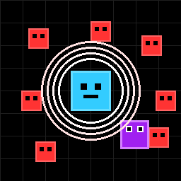

# the hardest game

## Description
the hardest game est un jeu composé de 100 niveaux avec difficulté croissante. Il est créé en HTML/JavaScript et utilise la Web Audio API pour la musique procédurale.

## Installation
- Exécutez le jeu en ouvrant `the-hardest-game.html` dans un navigateur web

## jouer online
**[👉 Clique ici pour jouer !]( https://richerrail.github.io/the-hardest-game/)**

## Licence
Ce projet est sous licence MIT.
